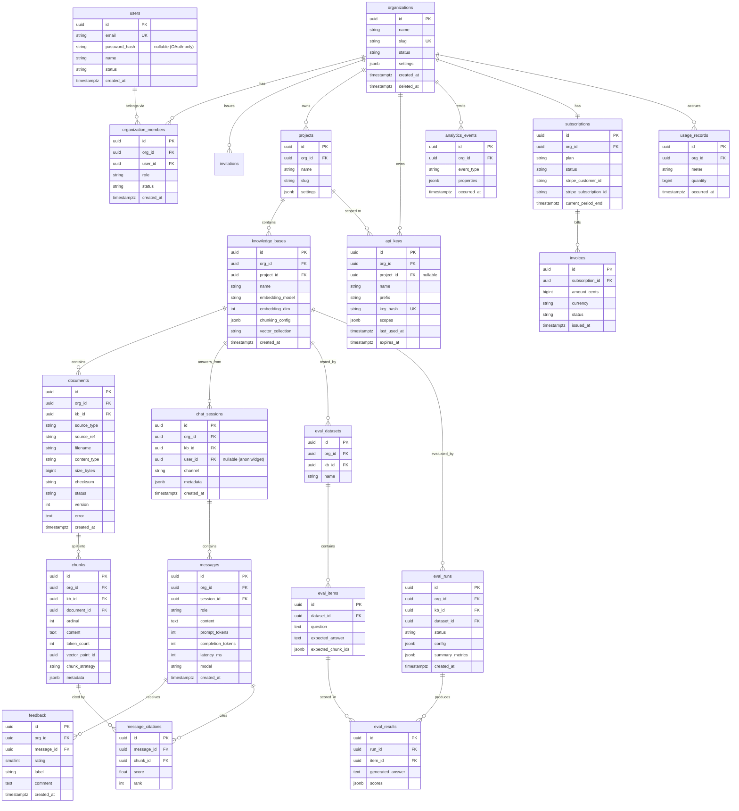

# Prompt 3 — PostgreSQL Database Design

> Scope: the **scale-up relational schema** for the RAG platform. The shipped MVP
> ([migrations/versions/0001_initial.py](../../migrations/versions/0001_initial.py))
> uses a flatter `tenants`-centric model with pgvector. This document designs the
> richer hierarchy (`Organizations → Projects → Knowledge Bases → Documents →
> Chunks`) the product grows into, and at each step notes how it extends what
> already exists. Postgres remains the **system of record**; vectors move to
> Qdrant (see [04-vector-db-design.md](04-vector-db-design.md)) but chunk *text*
> and *metadata* stay here.

---

## 1. Design principles (the "why" behind everything below)

1. **Postgres is the source of truth, Qdrant is a derived index.** Every chunk
   row can be re-embedded and re-pushed to Qdrant from Postgres alone. We never
   store anything *only* in the vector DB. This makes re-indexing, disaster
   recovery, and provider migration safe.
2. **`org_id` is on every tenant-scoped table.** Even when a child row could
   reach its org through a join, we denormalize `org_id` onto it. Reason:
   (a) single-column tenant filter for every query, (b) one RLS policy shape
   everywhere, (c) it becomes the natural partition/sharding key later. This is
   the same decision the MVP already made with `tenant_id`.
3. **UUID primary keys (UUIDv7).** Globally unique (safe to merge/move between
   environments), non-guessable in URLs, and v7 is time-ordered so it stays
   index-friendly like a bigserial. The MVP uses random UUIDv4; v7 is the only
   change recommended here, to reduce index fragmentation.
4. **Surrogate keys + separate natural keys.** Human-facing identifiers (`slug`,
   `email`) get their own unique constraints; we never use them as PKs because
   they change.
5. **Soft delete where audit/billing matters, hard delete + `ON DELETE CASCADE`
   where it doesn't.** Documents and chunks cascade-delete; organizations,
   invoices, and audit rows are retained (soft `deleted_at`).
6. **Money and counters never live in mutable columns alone.** Billing is
   event-sourced (append-only `usage_records` + periodic rollups) so a bug can't
   silently corrupt a balance.
7. **Time-series tables are partitioned from day one** (`messages`, `analytics_events`,
   `usage_records`). Retrofitting partitioning onto a hot table is painful.

---

## 2. Entity-Relationship Diagram

---

## 3. Table-by-table decisions

### 3.1 Organizations (the tenant boundary)
The MVP calls this `tenants`; conceptually identical. An organization is the
billing entity and the isolation boundary.

- `slug` (unique, citext) — used in URLs and OAuth callbacks; separate from the
  display `name` which is freely editable.
- `status` enum (`active | suspended | deleted`) — suspension must be a *fast*
  check on every request, so it's a column, not a join.
- `settings jsonb` — sparse, rarely-queried config (default model, data-residency
  region, retention days). JSONB avoids a wide table of mostly-null columns.
- `deleted_at` — soft delete; org data is retained for the contractual grace
  period before a purge job hard-deletes children.

### 3.2 Users vs. organization_members (why two tables)
A user is a **global identity** (one human, one row, one email). Membership is
a **many-to-many** join because the same person can belong to multiple orgs with
*different* roles. This is the single most important schema decision the MVP
doesn't yet make — its `users.tenant_id` ties a user to exactly one tenant.

- `users.password_hash` is **nullable**: OAuth-only users never set a password
  (see [05-authentication.md](05-authentication.md)).
- `users.email` is globally unique (citext, case-insensitive) — it's the login
  identity and the invite target.
- `organization_members.role` enum: `owner | admin | member | viewer`. Role lives
  on the membership, not the user, because it's org-relative.
- `UNIQUE(org_id, user_id)` — a user joins an org at most once.

### 3.3 Invitations
- `email` + `org_id` + `role` capture the offer; `token_hash` (never the raw
  token) authorizes acceptance; `expires_at` bounds it.
- `UNIQUE(org_id, email) WHERE accepted_at IS NULL` (partial unique) — at most
  one *pending* invite per email per org, but re-invites after acceptance are fine.

### 3.4 Projects
A workspace grouping inside an org (e.g. "Support Bot", "Internal Wiki"). It
exists so API keys, KBs, and analytics can be scoped below the billing boundary.
- `UNIQUE(org_id, slug)` — slugs unique within an org, not globally.

### 3.5 Knowledge Bases
The retrieval unit — a chatbot answers from exactly one KB (or a set, via a join
table if needed). The KB **pins the embedding contract**:
- `embedding_model` + `embedding_dim` — chunks in a KB must share one vector
  space. Changing the model is a *re-index*, not an in-place update, so it's
  recorded here and a migration creates a new KB version.
- `chunking_config jsonb` — strategy + params (see [07-chunking-engine.md](07-chunking-engine.md)).
- `vector_collection` — the Qdrant collection/namespace this KB maps to.

### 3.6 Documents
- `source_type` enum: `pdf | docx | txt | md | html | website | confluence |
  notion | gdrive`. Drives which parser runs.
- `source_ref` — external identity (URL, Notion page id, Confluence page id,
  Drive file id). Combined with `checksum` it powers **idempotent re-sync**:
  unchanged sources are skipped.
- `status` — the ingestion state machine: `pending → parsing → chunking →
  embedding → ready | failed`. Matches the MVP's resumable design; indexed
  because the resume sweep queries `WHERE status NOT IN ('ready','failed')`.
- `version` — incremented on re-ingest so old chunks can be retired atomically.
- `UNIQUE(kb_id, source_type, source_ref)` — one logical document per source per KB.

### 3.7 Chunks
The join between relational and vector worlds.
- `content` (text) lives **here**, not in Qdrant — keeps the vector DB lean and
  lets us re-embed without re-parsing.
- `vector_point_id` — the Qdrant point ID for this chunk (a UUID we generate, so
  the mapping is deterministic and re-pushable).
- `ordinal` — position within the document, for reconstructing context windows
  ("chunk before/after").
- `metadata jsonb` — heading path, page number, table/figure flags (populated by
  the chunker). Duplicated into the Qdrant payload for filtering.
- No vector column (that's the Qdrant migration). In the MVP this table *does*
  hold the `Vector(dim)` column — the scale-up removes it once Qdrant is the index.

### 3.8 Chat Sessions & Messages
- `chat_sessions.channel` enum: `api | widget | slack | …`; `user_id` nullable
  for anonymous public-widget chats.
- `messages.role` enum: `user | assistant | system | tool`.
- Token + latency + model columns on `messages` feed analytics and billing
  directly — no separate logging pipeline needed for the basics.
- **`message_citations` is a real table, not a JSONB blob** (the MVP stores
  citations as JSONB). A table gives a true FK to `chunks`, lets us answer
  "which chunks get cited most" with SQL, and survives chunk deletion via FK
  rules. JSONB citations were fine at MVP scale; analytics needs the relation.

### 3.9 Evaluations
Four tables: a **dataset** (golden Q/A), its **items**, a **run** (one execution
of a config against a dataset), and per-item **results**.
- `eval_runs.summary_metrics jsonb` — aggregate scores (faithfulness, context
  precision/recall, answer relevancy).
- `eval_results.scores jsonb` — per-item judge outputs.
  Separating run-summary from per-item results keeps the common "list my runs"
  query small while the heavy per-item data is fetched only on drill-down.

### 3.10 Analytics
`analytics_events` is an **append-only, partitioned** firehose (page views,
queries, ingestion events). Heavy aggregations run against **rollup tables**
(materialized or job-built daily summaries), never against the raw firehose in
the request path. Reason: keep writes cheap and unblocked; do analytical reads
off pre-aggregated rollups.

### 3.11 Billing
Three concerns kept separate:
- `subscriptions` — mirror of the Stripe subscription (plan, status, period).
  Stripe is the source of truth for *money*; we cache what we need for gating.
- `invoices` — issued invoice records (also reconciled from Stripe webhooks).
- `usage_records` — **append-only metered usage** (tokens, documents, queries).
  Aggregated per period for usage-based billing. Append-only because you must
  never lose or double-count a metered event; rollups are derived, not authoritative.
  This generalizes the MVP's single `usage_counters` table.

### 3.12 Feedback
Thumbs up/down + optional label/comment on an assistant message. FK to
`messages`; feeds both analytics and eval-dataset curation (good/bad answers
become golden examples).

---

## 4. Indexes (and why each exists)

| Table | Index | Purpose |
|---|---|---|
| every tenant table | `(org_id)` btree | tenant filter on every query |
| `users` | `UNIQUE(email)` citext | login lookup |
| `organization_members` | `UNIQUE(org_id, user_id)`; `(user_id)` | dedupe; "my orgs" listing |
| `invitations` | partial `UNIQUE(org_id, email) WHERE accepted_at IS NULL` | one live invite |
| `projects` / `knowledge_bases` | `UNIQUE(org_id, slug)` / `(project_id)` | scoping & listing |
| `documents` | `(kb_id, status)`; `UNIQUE(kb_id, source_type, source_ref)` | resume sweep; idempotent sync |
| `chunks` | `(document_id, ordinal)`; `(kb_id)` | context reconstruction; bulk re-index |
| `api_keys` | `UNIQUE(key_hash)`; `(org_id)` | O(1) auth lookup |
| `chat_sessions` | `(kb_id, created_at desc)` | recent sessions |
| `messages` | `(session_id, created_at)`; partitioned on `created_at` | thread fetch; pruning |
| `message_citations` | `(message_id)`; `(chunk_id)` | render citations; citation analytics |
| `analytics_events` | `(org_id, event_type, occurred_at)` BRIN on `occurred_at` | time-range scans, cheap on append-only |
| `usage_records` | `(org_id, meter, occurred_at)` | period aggregation |

**BRIN vs btree on time columns:** append-only, naturally time-ordered tables
(`analytics_events`, `usage_records`) use **BRIN** on the timestamp — tiny index,
ideal for range scans over correlated data. Random-access tables keep btree.

---

## 5. Constraints

- **Foreign keys everywhere**, with deliberate `ON DELETE` rules:
  - `documents → chunks`, `chat_sessions → messages`: `CASCADE` (children are
    worthless without the parent).
  - `chunks → message_citations`: `ON DELETE SET NULL` + a `deleted` flag, so a
    historical message keeps its citation text even if the chunk is re-indexed away.
  - `organizations → *`: `RESTRICT` at the DB level; org deletion goes through an
    application purge job, never a raw cascade, so billing/audit can be archived.
- **CHECK constraints** encode invariants the app must never violate:
  - `messages.role IN (...)`, `documents.status IN (...)`, `feedback.rating IN (-1,1)`.
  - `knowledge_bases.embedding_dim > 0`.
  - `usage_records.quantity >= 0`.
- **NOT NULL** is the default; nullable columns (`users.password_hash`,
  `chat_sessions.user_id`, `api_keys.project_id`) are deliberate and documented above.
- **Native enums vs. CHECK:** we use `VARCHAR + CHECK` (as the MVP does) rather
  than Postgres `ENUM` types, because adding a value to a CHECK is a cheap
  `ALTER`, while altering an `ENUM` is awkward in migrations.

---

## 6. Relationships summary

- `users` ⇄ `organizations` is **many-to-many** through `organization_members`
  (with a role). This is the backbone of multi-org membership and RBAC.
- Everything else is a **strict containment tree**:
  `org → project → knowledge_base → document → chunk`, every level carrying
  `org_id` for flat tenant filtering.
- `messages → chunks` is many-to-many through `message_citations` (provenance).
- `billing`, `analytics`, and `evaluations` hang off `org` / `knowledge_base`
  as satellite subsystems, intentionally decoupled so they can be moved to a
  separate database or warehouse later.

---

## 7. Partitioning strategy

| Table | Strategy | Key | Why |
|---|---|---|---|
| `messages` | **RANGE by month** on `created_at` | time | High write volume; old threads rarely read; drop old partitions to enforce retention cheaply (vs. mass `DELETE`). |
| `analytics_events` | **RANGE by month** on `occurred_at` | time | Firehose; query patterns are time-windowed; partition pruning skips old data. |
| `usage_records` | **RANGE by month** on `occurred_at` | time | Billing periods are monthly — one partition ≈ one billing cycle; archival is a partition detach. |
| `chunks` | **(future) HASH by `org_id`** | tenant | Only if a single table grows into the 100s of millions; keeps per-tenant scans local. Not needed early. |

**Decisions:**
- **Range-by-time for append-mostly, query-by-window tables.** Retention becomes
  `DETACH/DROP PARTITION` (instant) instead of a `DELETE` that bloats and vacuums.
- **Hash-by-org reserved for the largest table only**, and only once a noisy-tenant
  problem appears — premature hash partitioning hurts cross-tenant admin queries.
- **Default + future partitions are pre-created by a scheduled job** (e.g.
  `pg_partman`) so a month rollover never causes an insert to fail.
- Partition key must be part of the PK in Postgres declarative partitioning, so
  PKs on these tables become `(id, created_at)` — a deliberate composite.

---

## 8. How this maps back to the shipped MVP

| MVP (`0001_initial`) | Scale-up here | Migration path |
|---|---|---|
| `tenants` | `organizations` | rename + add `slug/status/settings` |
| `users.tenant_id` | `organization_members` join | backfill one membership per user |
| (none) | `projects`, `knowledge_bases` | one default project+KB per org |
| `document_chunks.embedding Vector` | `chunks` + Qdrant point | dual-write, then drop column |
| `chat_messages.citations jsonb` | `message_citations` table | backfill from JSONB |
| `usage_counters` | `usage_records` (event-sourced) | keep counters as a rollup |
| RLS via `app.tenant_id` | unchanged (rename GUC to `app.org_id`) | mechanical |

The hexagonal architecture means these are **adapter-level** changes: the domain
entities barely move. RLS, the `org_id`-on-everything rule, and the resumable
document state machine all carry forward unchanged.
